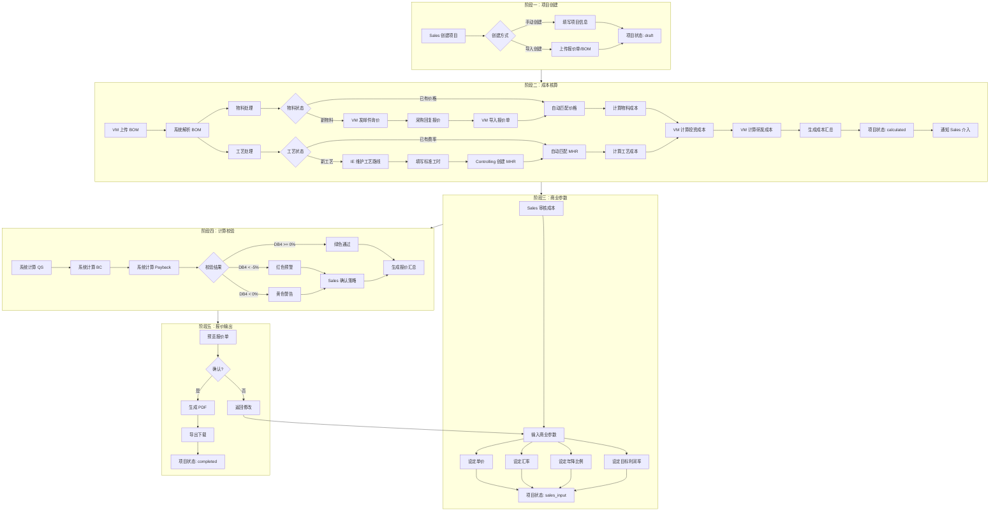
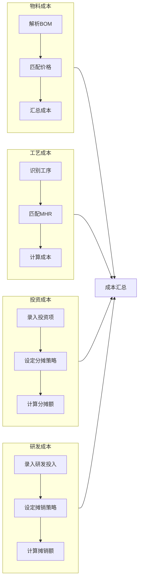
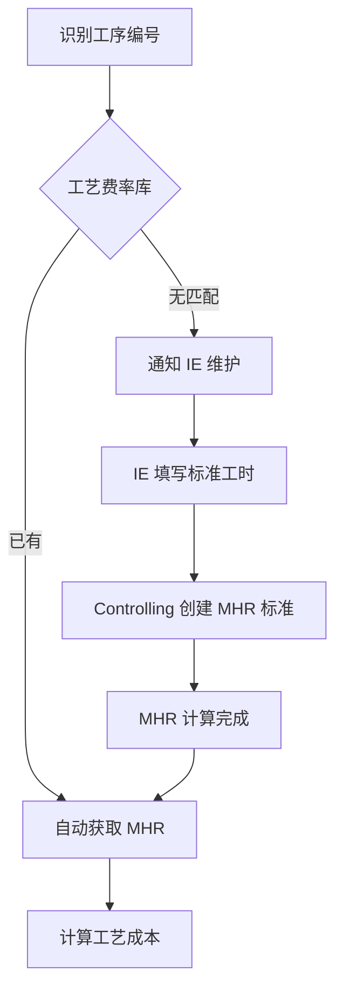
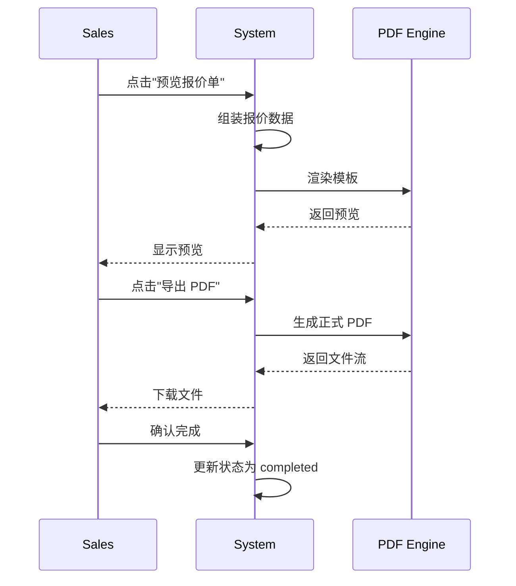

# Dr.aiVOSS 报价流程详解

| 版本号 | 创建时间 | 更新时间 | 文档主题 | 创建人 |
|--------|----------|----------|----------|--------|
| v1.0   | 2026-02-13 | 2026-02-13 | Dr.aiVOSS 完整报价流程 | Randy Luo |

---

## 1. 流程概览

### 1.1 端到端流程图



### 1.2 流程阶段总结

| 阶段 | 名称 | 主要负责人 | 输入 | 输出 | 状态流转 |
|------|------|-----------|------|------|----------|
| **1** | 项目创建 | Sales | 项目信息/BOM文件 | 项目记录 | `draft` |
| **2** | 成本核算 | VM | BOM数据 | 成本明细 | `draft → parsing → calculated` |
| **3** | 商业参数 | Sales | 成本数据 | 商业参数 | `calculated → sales_input` |
| **4** | 计算校验 | 系统 | 成本+参数 | QS/BC/Payback | `sales_input` |
| **5** | 报价输出 | Sales | QS/BC/Payback | PDF报价单 | `sales_input → completed` |

---

## 2. 阶段一：项目创建

### 2.1 创建方式

#### 方式 A：手动创建

**操作人：** Sales

**步骤：**
1. 点击"新建项目"按钮
2. 填写项目基础信息
3. 点击"保存"

**必填字段：**
| 字段 | 说明 | 示例 |
|------|------|------|
| 项目名称 | 项目描述性名称 | 制动管路总成报价 |
| AS 号 | 项目唯一编号 | AS-2024-001 |
| 客户名称 | 客户公司名称 | 博世汽车部件（苏州）有限公司 |
| 客户编码 | 客户内部编码 | BOSCH-2024-Q1 |
| 项目年量 | 年度销量预估 | 120,000 |

**可选字段：**
| 字段 | 说明 |
|------|------|
| 产品版本 | 产品版本号 |
| 客户版本 | 客户版本号 |
| 工厂 | 所属工厂 |
| 描述 | 项目详细描述 |

#### 方式 B：导入创建

**操作人：** Sales

**步骤：**
1. 点击"导入项目"按钮
2. 选择文件（Excel/CSV/PDF）
3. 系统自动解析并创建项目

**支持的文件格式：**
- Excel (.xlsx, .xls)
- CSV (.csv)
- PDF 报价单

**解析逻辑：**
1. AI 识别文件类型
2. 提取项目信息（客户、产品、数量）
3. 自动创建项目记录
4. 关联解析出的 BOM 数据

### 2.2 API 调用

```http
POST /api/v1/projects
Content-Type: application/json

{
  "projectName": "制动管路总成报价",
  "asacNumber": "AS-2024-001",
  "clientName": "博世汽车部件（苏州）有限公司",
  "customerNumber": "BOSCH-2024-Q1",
  "annualVolume": "120000",
  "factoryId": "F001",
  "description": "2024年新项目报价"
}
```

### 2.3 数据库变更

```sql
INSERT INTO projects (
    id, project_code, project_name, asac_number,
    client_name, customer_number, annual_volume,
    factory_id, status, created_at
) VALUES (
    UUID(), 'PRJ-2024-001', '制动管路总成报价', 'AS-2024-001',
    '博世汽车部件（苏州）有限公司', 'BOSCH-2024-Q1', 120000,
    'F001', 'draft', NOW()
);
```

---

## 3. 阶段二：成本核算

### 3.1 子流程总览

成本核算分为四个并行计算模块：



### 3.2 物料成本计算

#### 3.2.1 BOM 上传与解析

**操作人：** VM

**步骤：**
1. 进入项目详情页
2. 点击"上传 BOM"按钮
3. 拖拽或选择文件
4. 系统自动解析

**解析流程：**
```
文件上传 → 格式验证 → AI 特征提取 → 数据结构化 → 红绿灯标记
```

**AI 特征提取规则：**
- 重点关注 Comments 列
- 提取工艺信息（如"弯管"、"压桩"）
- 识别数量、规格等参数
- 输出结构化 JSON

#### 3.2.2 物料价格匹配

**红绿灯逻辑：**
| 状态 | 条件 | 处理方式 |
|------|------|----------|
| 🟢 Green | 物料号完全匹配 | 自动采用标准价格 |
| 🟡 Yellow | AI 语义匹配 > 85% | 标记待确认，VM 核对 |
| 🔴 Red | 无匹配 | 发起询价 |

#### 3.2.3 新物料询价流程

**触发条件：** 物料状态为 Red

**流程：**
```
VM 点击"发送询价"
    ↓
系统汇总项目级物料需求
    ↓
生成询价邮件（物料编码、数量、推荐供应商）
    ↓
发送给采购部门
    ↓
采购联系供应商获取报价
    ↓
采购邮件回复报价单
    ↓
VM 导入报价单
    ↓
系统 AI 识别价格并入库
    ↓
物料状态更新为 Green
```

**API 调用：**
```http
POST /api/v1/procurement/send-request
Content-Type: application/json

{
  "projectId": "PRJ-2024-001",
  "materials": [
    {
      "materialCode": "A356-T6",
      "materialName": "铝合金",
      "totalQuantity": 350.5,
      "unit": "kg"
    }
  ],
  "recipients": ["procurement@company.com"],
  "deadline": "2024-02-10"
}
```

#### 3.2.4 物料成本汇总公式

$$Cost_{material} = \sum_{i=1}^{n} (Qty_i \times Price_{std,i})$$

### 3.3 工艺成本计算

#### 3.3.1 工序识别

**工序编码规则：** 字母 + 两位数字
- 字母：工作中心（I=注塑, A=装配, M=机加, T=检测, P=包装, S=表处）
- 数字：工序序号（01-99）

**示例：**
| 工序编号 | 工作中心 | 工序名称 |
|---------|---------|---------|
| I01 | 注塑 | 注塑成型 |
| A02 | 装配 | 压桩装配 |
| M03 | 机加 | 切管加工 |

#### 3.3.2 MHR 获取流程



#### 3.3.3 MHR 计算公式

**固定成本/小时（由 Controlling 维护）：**
$$Cost_{fix} = \frac{Rent \times Area}{Hours} + \frac{Equipment}{Years \times Hours} + \frac{Equipment \times Rate}{2 \times Hours}$$

**变动成本/小时（由 IE 输入）：**
$$Cost_{var} = EnergyPrice \times Power \times LoadFactor$$

**MHR 总费率：**
$$MHR_{total} = MHR_{fix} + MHR_{var}$$

#### 3.3.4 工艺成本公式

$$Cost_{process} = \sum_{j=1}^{m} \left( \frac{CycleTime_j}{3600} \times (MHR_{total,j} + Personnel_j \times LaborRate_j) \right)$$

> **详细逻辑：** 参见 [PROCESS_COST_LOGIC.md](PROCESS_COST_LOGIC.md)

### 3.4 投资成本计算

#### 3.4.1 投资类型

| 类型 | 英文 | 说明 | 示例 |
|------|------|------|------|
| 模具 | MOLD | 高价值、长周期 | 注塑模、冲压模 |
| 检具 | GAUGE | 质量控制用 | 通止规、测试台 |
| 夹具 | JIG | 定位与固定 | 焊接定位座 |
| 工装 | FIXTURE | 辅助加工 | 机械手抓手 |

#### 3.4.2 分摊模式

**模式 A：一次性支付（Upfront）**
- 客户单独付费
- Tooling 列为 0
- 生成独立 NRE 报价单

**模式 B：分摊进单价（Amortized）—— 默认模式**
- 公司垫资开模
- 客户通过买零件分期还款
- **含资本利息（Capital Interest）**

#### 3.4.3 分摊计算公式

$$UnitAmort = \frac{I_{total} \times (1 + R_{interest} \times Y_{amort})}{V_{amort}}$$

**示例：**
- 模具费：¥170,000
- 分摊年限：2 年
- 资本利率：6%
- 分摊量：29,750 件
- 含息因子：$1 + 0.06 \times 2 = 1.12$
- 含息总额：$170,000 \times 1.12 = ¥190,400$
- 单件分摊：$190,400 / 29,750 = ¥6.40$

> **详细逻辑：** 参见 [NRE_INVESTMENT_LOGIC.md](NRE_INVESTMENT_LOGIC.md)

### 3.5 研发成本计算

#### 3.5.1 研发投入类型

| 类型 | 说明 | 示例 |
|------|------|------|
| 设计费 | 产品设计开发 | 3D 建模、工程图纸 |
| 测试费 | 验证测试 | 性能测试、可靠性测试 |
| 认证费 | 资质认证 | ISO 认证、客户审核 |

#### 3.5.2 摊销计算

$$UnitRnD = \frac{RnD_{total} \times (1 + R_{interest} \times Y_{amort})}{V_{amort}}$$

### 3.6 成本汇总

#### 3.6.1 成本层级结构

```
总成本 (SK-2)
├── 制造成本 (HK III)
│   ├── 物料成本 (Material Cost)
│   │   ├── 原材料
│   │   └── 外购件
│   └── 工艺成本 (Process Cost)
│       ├── 机台成本
│       └── 人工成本
├── 管销费用 (S&A)
│   └── 净销售额 × 2.1%
├── 投资分摊 (Tooling Amortization)
│   ├── 模具分摊（含资本利息）
│   ├── 检具分摊
│   ├── 夹具分摊
│   └── 工装分摊
├── 研发分摊 (R&D Amortization)
├── 营运资金利息 (Working Capital Interest)
│   └── VP × 利率 × (账期/360)
└── 物流费用 (Logistics)
```

#### 3.6.2 成本计算公式汇总

| 成本项 | 公式 |
|--------|------|
| **HK III** | $Cost_{material} + Cost_{process}$ |
| **SK-1** | $HK\ III + (Net\_Sales \times S\&A\_Rate)$ |
| **SK-2** | $SK\text{-}1 + Tooling + R\&D + WorkingCap + Logistics$ |

---

## 4. 阶段三：商业参数输入

### 4.1 Sales 操作界面

**触发条件：** 项目状态为 `calculated`，VM 完成所有成本核算

**操作人：** Sales

### 4.2 商业参数清单

| 参数 | 说明 | 单位 | 示例 | 来源 |
|------|------|------|------|------|
| 报价单价 | 给客户的开票价格 | 元/件 | 5.00 | Sales 输入 |
| 汇率 | 人民币对目标币种 | - | 7.83 | 系统默认/手动 |
| 年降比例 | 每年价格下降幅度 | % | 3.0% | Sales 输入 |
| 目标利润率 | 期望的净利润率 | % | 15% | Sales 输入 |
| 付款账期 | 客户付款周期 | 天 | 90 | Sales 输入 |
| 分摊策略 | 投资分摊方式 | - | Amortized | Sales 选择 |
| 分摊年限 | 投资分摊期限 | 年 | 2 | Sales 输入 |

### 4.3 分摊策略选择

**界面展示：**

```
┌─────────────────────────────────────────────────────────────┐
│  分摊策略配置                                                │
├─────────────────────────────────────────────────────────────┤
│                                                              │
│  投资分摊模式：                                              │
│  ○ 一次性支付 (Upfront)                                     │
│    客户单独支付投资费用，不计入零件单价                      │
│                                                              │
│  ● 分摊进单价 (Amortized)                                   │
│    投资费用分摊到零件单价中，含资本利息                      │
│                                                              │
│  分摊年限：[  2  ] 年                                        │
│  分摊基数：[ 29,750 ] 件（前两年预估销量）                   │
│  资本利率：6.0%（由 Controlling 配置）                       │
│                                                              │
│  预计单件分摊额：¥ 6.40                                     │
└─────────────────────────────────────────────────────────────┘
```

### 4.4 API 调用

```http
PUT /api/v1/quotations/{projectId}/params
Content-Type: application/json

{
  "quotedPrice": 5.00,
  "exchangeRate": 7.83,
  "annualReductionRate": 0.03,
  "targetMargin": 0.15,
  "paymentTermsDays": 90,
  "amortizationStrategy": {
    "mode": "AMORTIZED",
    "durationYears": 2,
    "amortizationVolume": 29750
  }
}
```

---

## 5. 阶段四：系统计算校验

### 5.1 自动计算流程


### 5.2 QS（Quote Summary）计算

#### 5.2.1 年度数据计算

**遍历每一年（Base Year → End Year）：**

1. **计算年降后单价：**
   $$VP_n = VP_{base} \times (1 - LTA)^{n - base}$$

2. **计算净销售额：**
   $$Net\_Sales_n = Volume_n \times VP_n$$

3. **计算成本层级：**
   | 成本项 | 计算公式 |
   |--------|----------|
   | HK III | 物料成本 + 工艺成本 |
   | SK-1 | HK III + (Net Sales × S&A Rate) |
   | SK-2 | SK-1 + Tooling + R&D + WorkingCap + Logistics |

4. **计算利润指标：**
   $$DB4 = \frac{VP - SK\_2}{VP}$$

#### 5.2.2 QS 输出示例

| Year | Volume | HK3 | SK1 | Tooling | R&D | Working Cap | SK2 | VP | DB4% | 预警 |
|------|--------|-----|-----|---------|-----|-------------|-----|----|----|------|
| 2026 | 7,085 | 46.24 | 54.33 | 6.40 | 0.54 | 0.73 | 63.85 | 57.90 | -10.29% | ⚠️ |
| 2027 | 8,500 | 44.85 | 52.70 | 6.40 | 0.54 | 0.70 | 62.01 | 56.16 | -10.40% | ⚠️ |
| 2028 | 9,000 | 43.50 | 51.12 | 0 | 0 | 0.68 | 55.05 | 54.48 | -1.06% | |

> **详细逻辑：** 参见 [QUOTATION_SUMMARY_LOGIC.md](QUOTATION_SUMMARY_LOGIC.md)

### 5.3 BC（Business Case）计算

#### 5.3.1 收入侧计算

| 指标 | 公式 |
|------|------|
| Gross Sales | $Volume \times Base\_Price$ |
| Net Price | $Base\_Price \times (1 - \sum Reduction\_Rate)$ |
| Net Sales | $Volume \times Net\_Price$ |

#### 5.3.2 利润指标计算

| 指标 | 公式 | 业务含义 |
|------|------|----------|
| **DB I** | $Net\_Sales - HK\_III$ | 生产毛利 |
| **DB IV** | $Net\_Sales - SK$ | 净利润 |

> **详细逻辑：** 参见 [BUSINESS_CASE_LOGIC.md](BUSINESS_CASE_LOGIC.md)

### 5.4 Payback（投资回收期）计算

#### 5.4.1 静态回收期公式

$$Payback\ (月) = \frac{项目总投资}{月度净利}$$

#### 5.4.2 月度净利计算

$$P_{monthly} = (Price_{quoted} - Cost_{unit}) \times \frac{Volume_{annual}}{12}$$

#### 5.4.3 推荐等级

| 等级 | 回收期 | 建议 |
|------|--------|------|
| 🟢 极力推荐 | ≤ 12 个月 | 投资回报快 |
| 🟡 推荐 | 12 - 24 个月 | 风险可控 |
| 🟠 谨慎 | 24 - 36 个月 | 需评估风险 |
| 🔴 不推荐 | > 36 个月 | 建议调整策略 |

> **详细逻辑：** 参见 [PAYBACK_LOGIC.md](PAYBACK_LOGIC.md)

### 5.5 校验与预警

#### 5.5.1 预警规则

| 预警级别 | 触发条件 | 样式 | 处理建议 |
|----------|----------|------|----------|
| 🔴 高风险 | DB4 < -5% | 红色背景 + ⚠️ | 需 Sales 确认策略意图 |
| 🟡 警告 | DB4 < 0% | 黄色背景 | 提示亏损风险 |
| 🟢 正常 | DB4 >= 0% | 绿色背景 | 可直接通过 |

#### 5.5.2 预警提示文案

```
⚠️ 注意！前两年亏损严重（DB4 = -10.29%），
请确认是否包含战略意图（如市场份额获取、客户关系维护）。
```

### 5.6 API 响应示例

```http
POST /api/v1/quotations/{projectId}/calculate
```

```json
{
  "projectId": "PRJ-2024-001",
  "versionNumber": 1.0,
  "summary": {
    "totalInvestment": 230000,
    "annualVolume": 120000,
    "quotedPrice": 5.00,
    "hk3Cost": 4.00,
    "skCost": 4.10,
    "db4Rate": 0.18,
    "paybackMonths": 25.56,
    "recommendation": "推荐"
  },
  "yearlyData": [
    {
      "year": 2026,
      "volume": 7085,
      "netSales": 410416.50,
      "hk3Cost": 327654.40,
      "skCost": 452616.25,
      "db4Rate": -0.1029,
      "isWarning": true
    }
  ],
  "warnings": [
    "2026年 DB4 为 -10.29%，存在亏损风险"
  ],
  "validation": {
    "isValid": true,
    "warnings": ["DB4 在前两年为负"],
    "errors": []
  }
}
```

---

## 6. 阶段五：报价单生成与导出

### 6.1 报价单模板结构

```
┌─────────────────────────────────────────────────────────────┐
│                      报价单 (Quotation)                      │
│                    VOSS Automotive                          │
├─────────────────────────────────────────────────────────────┤
│  项目信息                                                    │
│  ─────────────────────────────────────────────────────────  │
│  项目编号：PRJ-2024-001                                      │
│  项目名称：制动管路总成报价                                   │
│  客户名称：博世汽车部件（苏州）有限公司                        │
│  报价日期：2024-02-13                                        │
│  有效期至：2024-03-13                                        │
├─────────────────────────────────────────────────────────────┤
│  产品信息                                                    │
│  ─────────────────────────────────────────────────────────  │
│  产品名称        │  年量    │  单价   │  年度总额           │
│  制动管路总成    │ 120,000  │ ¥ 5.00 │ ¥ 600,000          │
├─────────────────────────────────────────────────────────────┤
│  成本分解 (Breakdown)                                        │
│  ─────────────────────────────────────────────────────────  │
│  物料成本        │ ¥ 3.00   │ 60.0%  │                     │
│  工艺成本        │ ¥ 1.00   │ 20.0%  │                     │
│  管销费用        │ ¥ 0.10   │ 2.0%   │                     │
│  投资分摊        │ ¥ 0.50   │ 10.0%  │                     │
│  ─────────────────────────────────────────────────────────  │
│  HK III（制造成本）│ ¥ 4.00 │ 80.0%  │                     │
│  SK（完全成本）    │ ¥ 4.60 │ 92.0%  │                     │
├─────────────────────────────────────────────────────────────┤
│  财务指标                                                    │
│  ─────────────────────────────────────────────────────────  │
│  目标利润率      │ 15%      │                                   │
│  实际利润率      │ 8%       │                                   │
│  投资回收期      │ 26 个月  │                                   │
├─────────────────────────────────────────────────────────────┤
│  条款与条件                                                  │
│  ─────────────────────────────────────────────────────────  │
│  1. 付款条件：月结 90 天                                     │
│  2. 年降条款：每年 3%                                        │
│  3. 交货周期：12 周                                          │
│  4. 质保条款：24 个月 / 10 万公里                            │
├─────────────────────────────────────────────────────────────┤
│  签章                                                        │
│  ─────────────────────────────────────────────────────────  │
│  销售经理：___________  日期：___________                    │
│  财务总监：___________  日期：___________                    │
└─────────────────────────────────────────────────────────────┘
```

### 6.2 导出流程



### 6.3 API 调用

```http
# 预览报价单
GET /api/v1/quotation/{projectId}/preview

# 导出 PDF
GET /api/v1/quotation/{projectId}/export?format=pdf

# 确认完成
PUT /api/v1/projects/{projectId}/complete
```

### 6.4 状态更新

```sql
UPDATE projects
SET status = 'completed',
    updated_at = NOW()
WHERE id = 'PRJ-2024-001';
```

---

## 7. 角色职责矩阵

### 7.1 完整职责矩阵

| 流程节点 | Sales | VM | IE | Controlling | 采购 |
|----------|-------|----|----|-------------|------|
| 创建项目 | ✅ 主导 | ❌ | ❌ | ❌ | ❌ |
| 上传 BOM | ❌ | ✅ 主导 | ❌ | ❌ | ❌ |
| 物料价格匹配 | ❌ | 🔶 自动 | ❌ | ❌ | ❌ |
| 新物料询价 | ❌ | ✅ 主导 | ❌ | ❌ | 📧 邮件 |
| 工艺费率匹配 | ❌ | 🔶 自动 | ❌ | ❌ | ❌ |
| 新工艺路线维护 | ❌ | ❌ | ✅ 主导 | ❌ | ❌ |
| 创建 MHR 标准 | ❌ | ❌ | ❌ | ✅ 主导 | ❌ |
| 投资成本计算 | ❌ | ✅ 主导 | 🔶 辅助 | ❌ | ❌ |
| 研发成本计算 | ❌ | ✅ 主导 | ❌ | ❌ | ❌ |
| 审核成本 | ✅ 主导 | ❌ | ❌ | ❌ | ❌ |
| 输入商业参数 | ✅ 主导 | ❌ | ❌ | ❌ | ❌ |
| 计算 QS/BC/Payback | 🔶 系统 | 🔶 系统 | ❌ | ❌ | ❌ |
| 导出报价单 | ✅ 主导 | ❌ | ❌ | ❌ | ❌ |

*注：🔶 表示系统自动执行；📧 表示邮件交互*

### 7.2 通知机制

| 事件 | 通知对象 | 通知方式 |
|------|----------|----------|
| 项目创建成功 | VM | 站内消息 + 邮件 |
| BOM 解析完成 | VM | 站内消息 |
| 新物料需询价 | 采购 | 邮件 |
| 成本核算完成 | Sales | 站内消息 + 邮件 |
| 报价单已生成 | Sales | 站内消息 |

---

## 8. 数据流向图

```
┌─────────────────────────────────────────────────────────────────────────┐
│                           Sales 发起项目                                 │
│  输入：项目名称、客户、年量                                               │
└─────────────────────────────────────────────────────────────────────────┘
                                    ↓
┌─────────────────────────────────────────────────────────────────────────┐
│                           VM 上传 BOM                                    │
│  输出：物料列表 + 工艺列表                                                │
└─────────────────────────────────────────────────────────────────────────┘
                                    ↓
         ┌──────────────────────────┴──────────────────────────┐
         ↓                                                      ↓
┌─────────────────────────┐                        ┌─────────────────────────┐
│     物料成本计算         │                        │     工艺成本计算         │
│  • 匹配物料库价格        │                        │  • 识别工序编号          │
│  • 发起询价（新物料）    │                        │  • 匹配 MHR 费率         │
│  • 导入报价单            │                        │  • 计算 MHR（新工艺）    │
│  输出：物料成本汇总      │                        │  输出：工艺成本汇总      │
└─────────────────────────┘                        └─────────────────────────┘
         ↓                                                      ↓
         └──────────────────────────┬──────────────────────────┘
                                    ↓
┌─────────────────────────────────────────────────────────────────────────┐
│                           投资成本计算 (VM)                              │
│  输入：模具、检具、夹具、工装投入                                         │
│  计算：分摊策略 → 单件分摊额                                              │
│  输出：投资分摊成本                                                      │
└─────────────────────────────────────────────────────────────────────────┘
                                    ↓
┌─────────────────────────────────────────────────────────────────────────┐
│                           研发成本计算 (VM)                              │
│  输入：设计费、测试费、认证费                                             │
│  计算：摊销策略 → 单件摊销额                                              │
│  输出：研发分摊成本                                                      │
└─────────────────────────────────────────────────────────────────────────┘
                                    ↓
┌─────────────────────────────────────────────────────────────────────────┐
│                           成本汇总 (HK III / SK)                         │
│  HK III = 物料成本 + 工艺成本                                            │
│  SK-1 = HK III + S&A                                                    │
│  SK-2 = SK-1 + 投资分摊 + 研发分摊 + Working Cap + 物流                  │
└─────────────────────────────────────────────────────────────────────────┘
                                    ↓
┌─────────────────────────────────────────────────────────────────────────┐
│                           Sales 输入商业参数                             │
│  输入：单价、汇率、年降、利润率、分摊策略                                 │
└─────────────────────────────────────────────────────────────────────────┘
                                    ↓
┌─────────────────────────────────────────────────────────────────────────┐
│                           系统自动计算                                   │
│  • QS：年度报价摘要（逐年 VP、SK、DB4）                                  │
│  • BC：Business Case（收入、成本、利润）                                 │
│  • Payback：投资回收期                                                   │
│  • 预警：DB4 < -5% 红色预警                                              │
└─────────────────────────────────────────────────────────────────────────┘
                                    ↓
┌─────────────────────────────────────────────────────────────────────────┐
│                           报价单生成与导出                               │
│  输出：PDF 报价单                                                        │
└─────────────────────────────────────────────────────────────────────────┘
```

---

## 9. 异常处理

### 9.1 常见异常场景

| 场景 | 处理方式 | 责任人 |
|------|----------|--------|
| BOM 解析失败 | 提示格式错误，提供标准模板 | VM |
| 物料无价格 | 自动标记为 Red，触发询价 | VM |
| 工艺无 MHR | 通知 IE 维护，Controlling 创建 | IE + Controlling |
| 采购未回复 | 超时提醒（48小时），升级处理 | VM |
| DB4 严重亏损 | 红色预警，需 Sales 确认策略 | Sales |

### 9.2 回退机制

| 当前状态 | 可回退到 | 触发条件 |
|----------|----------|----------|
| `sales_input` | `calculated` | Sales 要求重新核算成本 |
| `calculated` | `parsing` | 发现 BOM 解析错误 |
| `parsing` | `draft` | 需要重新上传 BOM |

---
